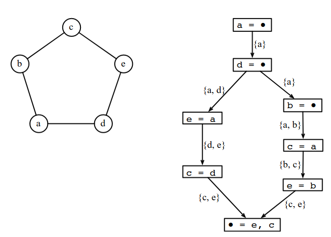
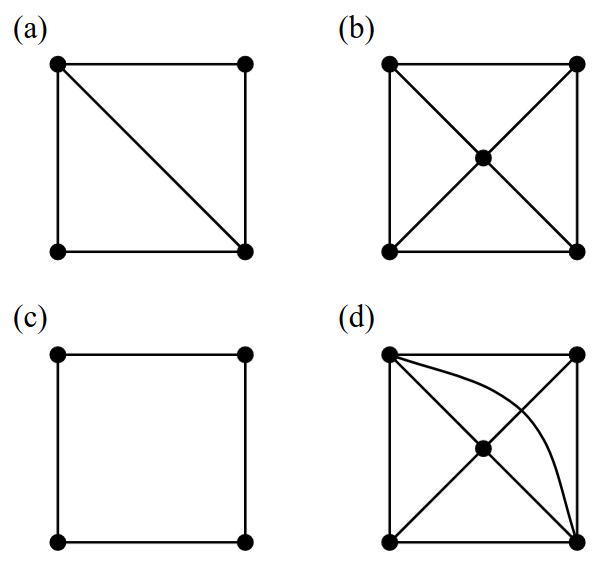
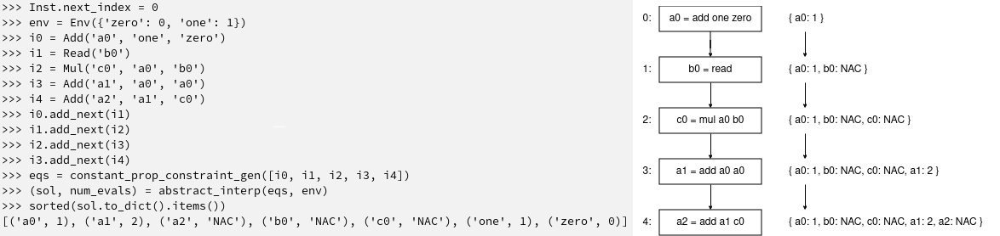

# Register allocation by coloring chordal graphs
This exercise is based on part of the paper [Register Allocation via Coloring of Chordal Graphs](https://homepages.dcc.ufmg.br/~fernando/publications/papers/APLAS05.pdf). Although programs may introduce an arbitrary number of variables, all software runs on an underlying CPU with a limited number of registers. This comes forth the problem of **register allocation**: given the limited amount of registers available, changing the program in order to reduce its register demand is quite useful. Figuring out how many registers are necessary for all variables in the current program is one step of solving this problem.

Variables that are simultaneously alive require concurrent registers. It is useful to build an interference graph that represents each variable as a vertex, while edges connect variables that share live time in the program. Register assignment can be represented by coloring a vertex, thus turning the problem into an instance of graph-coloring. While discovering the chromatic number of a general graph is NP-complete, the minimum coloring of chordal (triangular) graphs can be found in linear time. Fortunately, [SSA-form programs have chordal interference graphs](https://compilers.cs.uni-saarland.de/papers/ifg_ssa.pdf).

# TODO: picture of interference graph


# TODO: picture of chordal graph


## The Assignment
This lab consists in implementing the algorithm for finding the chromatic number (the minimum amount of required registers) for programs in SSA-form. By the end we will be able not only to know how many registers are required, but obtain a sample coloring (note that the exact colorings may vary on each iteration). In order to do so, the incomplete class `InterferenceGraph` is presented. This class builds the interference graph of a program, should contain all the logic for register allocation.

Students must implement the methods `maximum_cardinality_search` and `greedy_coloring` , the two main algorithms involved in coloring chordal graphs. A third method, `pop`, should be implemented as a helper function when extracting vertices during MCS.


Besides the `driver.py` and `lang.py` modules, the following files are required:
- A [liveness analysis](../IntroDataFlow) implementation.
- [phi functions](../PhiFunctions) should be fully implemented.

Note also that `lang.py` has been slightly modified to allow numbers to be used directly in programs. This removes the need to define all numbers as environment variables, hence reducing overlapping variables and simplifying register allocation.


## Uploading the Assignment

Students enrolled in DCC888 have access to UFMG's grading system, via [Moodle](https://moodle.org/).
You must upload four python files to have your assignment graded: [driver.py](driver.py), [lang.py](lang.py) and [parser.py](parser.py)
Remember to click on "*Avaliar*" to have your assignment graded.

## Testing without Moodle

As in the previous labs, all the files in this exercise contain `doctest` comments.
You can easily test your implementation by doing, for instance:

```
python3 -m doctest lang.py
```

As an example, the following program is included in the Doctests:



This lab also provides a [folder](tests) with some test cases.
To simulate automatic grading, you can run [drive.py](driver.py) directly, e.g.:

```
python3 driver.py < tests/fib.txt
```
