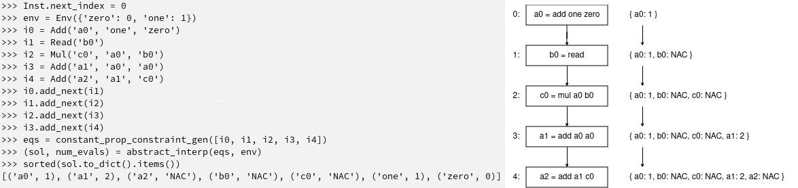

# Type Checking
As with semantic rules, a program may also be interpreted with a set of type rules applyable to the same syntax.

## The Assignment
In this lab we must built a simple type-checker in the model language. In order to do this, a new set of features has been implemented:
- A new TypeEnv extends the Env class and is restricted for type-checking.
- A new InstTypeErr describes when a given program has a type-invalid instruction
- Read instruction has been split into the typed instructions ReadNum and ReadBool
- All instructions (Add, Mul, Lth, Geq, Bt, Phi, PhiBlock, ReadNum, ReadBool) have a `type_eval` method.
- A new global `type_check` function.

In order to implement the type-checker, all `type_eval` methods must be implemented. If an instruction instance leads up to a stuck state, an `InstTypeErr` exception must be raised. Furthermore, the `type_check` function must iterate over the program and, by using `type_eval`, verify if the whole program is sound. Be mindful of Phi and PhiBlock instructions.

Besides the `driver.py` and `lang.py` modules, the following files are required:
- A [parser implementation](../Parsing).
- [phi functions](../PhiFunctions) should be fully implemented.

Thus, as a preliminary step, rename your parser, from that lab, from `todo.py` to `parser.py`. In order to have functional Phi functions, their `eval` methods may be copied from previous exercises - our goal is to maintain a usable language.


> Observe that `abstract_interp` requires an `Env` parameter. This is due to the fact that this analysis must actually calculate operations among constants. This should be the same environment read from the original program - this is safe, the function operates over a copy of this object.

This analysis utilizes a fairly simple lattice:


Where every variable starts as "undefined". Observe that "meet" operations move variables sideways or up the lattice. In this exercise, variables will only appear as "undefined" if their operands are absent from the Env.

Since this analysis requires actually computing constant operations, it is useful to remember some features of an `Inst` object:
- `inst.uses() -> set[str]` returns the names of all variables being used in its operation.
- `inst.definition() -> set[str]` returns the names of all variables being assigned the operation's result.

## Uploading the Assignment

Students enrolled in DCC888 have access to UFMG's grading system, via [Moodle](https://moodle.org/).
You must upload four python files to have your assignment graded: [driver.py](driver.py), [lang.py](lang.py), [parser.py](parser.py) and
[dataflow.py](dataflow.py).
Remember to click on "*Avaliar*" to have your assignment graded.

## Testing without Moodle

As in the previous labs, all the files in this exercise contain `doctest` comments.
You can easily test your implementation by doing, for instance:

```
python3 -m doctest dataflow.py
```

As an example, the following program is included in the Doctests:



This lab also provides a [folder](tests) with some test cases.
To simulate automatic grading, you can run [drive.py](driver.py) directly, e.g.:

```
python3 driver.py < tests/fib.txt
```

In this exercise, the driver prints the dominance tree of each program.
